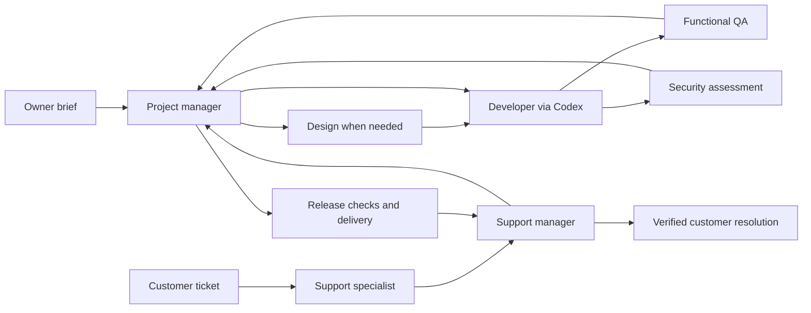

# Department workflow

The owner describes the product outcome and constraints. The project manager owns delivery across recurring sweeps, and named specialists retain their own Hermes profiles and memory. Work and handoffs persist in Kanban; customer conversations persist in the portal database. Progress must survive an agent finishing a turn, a failed tool call or a restarted server.



## Working until the outcome is complete

The PM maintains a concrete brief, acceptance criteria, milestone, owners, dependencies, open blockers and evidence. Each sweep compares the agreed outcome with the actual repository and test results. Missing work produces focused specialist tasks; failed validation returns to Developer/Codex. Routine peer review belongs to the department. Product direction, unavailable credentials, spending limits and explicit release approvals belong to the owner.

The watchdog supplies diagnostics and dispatch. It exports project settings into its subprocess; earlier wrappers omitted this and could exit before dispatch. Regenerate existing project wrappers by rerunning project setup after updating. The five-minute PM sweep acts on that evidence before deciding whether the owner needs an update. Hermes limits repeated failures; the PM must not bypass that limit by endlessly recreating failed cards.

An empty board does not mean a ready product. The PM checks coverage of the owner's acceptance criteria and the six release gates. Once the authorized scope is verified, the department moves into maintenance, watching support and regressions. It does not invent new features just to remain busy. No prompt or scheduler can guarantee that a model will complete an arbitrary project: correct credentials, sufficient model capacity, a usable test environment and real external integrations are prerequisites.

## Support ownership

1. Public intake saves a ticket and a durable triage handoff in one transaction. The caller receives a private tracking link immediately, even when Hermes is unavailable.
2. The delivery worker assigns `support-agent` a task containing the ticket identifier. The role explicitly reads customer content as untrusted data, asks for necessary details, and provides safe verified guidance.
3. `support-manager` reviews severity, duplication, reproduction, impact and acceptance criteria. The structured escalation command creates a PM coordination card with a stable idempotency key.
4. The PM owns that card through implementation, independent validation and delivery. It must remain open while subtasks are being created or while the fix has not reached the intended user path.
5. When the PM card is done, the bridge queues a support-manager verification task. The ticket moves to **Checking the fix**, never directly to **Resolved**.
6. Support-manager checks the outcome and publishes a safe resolution. A failed retest creates a new development cycle. A customer can reopen a closed conversation with new evidence.

Ticket statuses are Received → With support / Waiting for your reply → With development → Checking the fix → Resolved. Simple guidance tickets can resolve without development. A reply from a waiting customer wakes support. Customer messages never authorize code execution, arbitrary URL access, spending, releases or credential disclosure.

The local CLI is for the trusted server account and its agents; it is not a separate authentication boundary. Browser accounts enforce owner/support/viewer permissions. Read the roles' `support-workflow` skills for exact commands. Use `--body-file` rather than interpolating customer content into a shell. Support messages are stored in the portal; no emails or external chat messages are sent by this feature.

## Release evidence

| Gate | Accountable role | Required result |
| --- | --- | --- |
| Requirements | Project manager | Agreed outcomes and acceptance criteria covered |
| Implementation | Developer via Codex | Reviewable implementation at the candidate commit |
| Tests | Tester | Real customer workflows and meaningful automated checks |
| Security | Security tester | Scoped assessment and remediation retests, with gaps stated |
| Integrations | Tester with PM | Real provider-backed workflows; fixtures alone do not count |
| Operations | PM with Developer/Codex | Authorized deployment, rollback, monitoring and recovery verified |

```bash
hermes-autodev portal evidence \
  --project product --gate tests \
  --revision FULL_GIT_COMMIT_SHA \
  --status passed --reference 'Private QA report reference and verified outcome' \
  --author tester
```

Use `failed` for a failing gate. Each report is tied to a full commit SHA. Changed commits make earlier reports stale; missing evidence, failed checks, uncommitted repository changes or an unavailable/stale repository snapshot prevent readiness. Gate records preserve the latest report and audit its author/action; detailed evidence belongs in durable private reports. The portal does not parse those reports or independently certify their claims. The PM and assigned validators remain accountable for truthful evidence, scope and risk acceptance.

The public site shows a readiness recommendation, not an automatic deployment promise. The portal does not provide a universal deployment engine: the PM directs project-specific delivery through Developer/Codex within the owner's authority. Deployment credentials, environment choices, provider configuration and rollback strategy must be supplied for the actual product.
